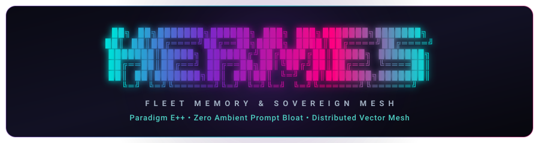

<div align="center">

<a href="https://github.com/amrlazw/hermes-fleet-memory">
  
</a>

<p align="center">
  <a href="https://fleet.republikus.my/api/telemetry/badge.svg"></a>
  <a href="https://github.com/amrlazw/hermes-fleet-memory/actions"></a>
  <a href="LICENSE"></a>
  <a href="https://modelcontextprotocol.io/"></a>
  <a href="https://qdrant.tech/"></a>
  <a href="#"></a>
  <a href="#"></a>
  <a href="#"></a>
</p>

</div>

---

### What is Paradigm E++?

**Paradigm E++** (*Epistemic State, Vector Embeddings, Distributed Execution Mesh*) is the formal architectural specification underlying Hermes Fleet Synapse:

1. **Zero Ambient Prompt Bloat (`memory.provider: none`):** Memory is never ambiently stuffed into the LLM system prompt. Retrieval is on-demand via explicit FastMCP vector searches (`fleet_synapse_search` / `fleet_memory_search`), cutting prompt costs to zero for turns where memory is unnecessary.
2. **Deterministic State Resolution (UUID5 + LWW):** Overwrites stale facts in-place using deterministic DNS-namespace UUID5 hashes (`domain:client_id:slot_name`), combined with **Last-Write-Wins (LWW)** timestamped validation to prevent out-of-order split-brain corruption.
3. **Infrastructure-Enforced Domain Firewalls (`FLEET_HARD_DOMAIN`):** Strict client-level boundary gates prevent enterprise data from cross-contaminating personal workstations, eliminating reliance on probabilistic LLM compliance.

---

```
                    ┌────────────────────────────────────────────────────────┐
                    │                   HERMES FLEET MESH                    │
                    └────────────────────────────────────────────────────────┘
                                                │
       ┌────────────────────────────────────────┼────────────────────────────────────────┐
       │                                        │                                        │
┌──────────────┐                         ┌──────────────┐                         ┌──────────────┐
│    NODE 1    │                         │    NODE 2    │                         │    NODE 3    │
│  Central Hub │                         │   Work PC    │                         │  Home Rig    │
│  (Cloud VPS) │                         │  (Corporate) │                         │  (Workstation)│
└──────┬───────┘                         └──────┬───────┘                         └──────┬───────┘
       │                                        │                                        │
       │ Telegram Gateway (@Bot)                │ Corporate Zscaler / MDM                │ Local GPU Inference
       │ FLEET_HARD_DOMAIN=all                  │ FLEET_HARD_DOMAIN=work                 │ FLEET_HARD_DOMAIN=personal
       │ Qdrant Vector Engine (:6333)           │ Outbound WSTunnel (TLS 443)            │ Desktop Bridge (:8099)
       │ Task Queue Plane (:8088)               │ Outbound FastMCP Task Client           │ Ollama Rig / RTX 3070 Ti
       ▼                                        ▼                                        ▼
```

### Sovereign Topology & Roles

| Node | Environment | Domain Guard | Authority & Mandates |
| :--- | :--- | :--- | :--- |
| **Node 1 (`chester`)** | Oracle Cloud SG ARM64 VPS | `all` | 24/7 Coordinator, Qdrant Vector Core, Telegram Gatekeeper (`@RepublikusBot`), Central Task Control Plane. |
| **Node 2 (`wolf`)** | Enterprise Work PC (Win 11) | `work` | Corporate Presales AI Engineer, MDM/Zscaler-traversing WSTunnel, RFP/Architecture evaluation. |
| **Node 3 (`winston`)** | Personal PC Rig (Win 11 Pro) | `personal` | Technical Butler, RTX 3070 Ti Local GPU Inference, Autonomous Startup Task Ingress, Desktop Automation. |

---

### Features & Capabilities

- **Autonomous Startup Task Ingress (`client/fleet_startup_sync.py`):** Nodes automatically connect on boot/resume, pull queued tasks asynchronously from Node 1, dispatch an executive Telegram briefing before work begins, and return Ed25519-signed completion receipts.
- **NAT & Firewall Traversal (WSTunnel over TLS 443):** Enterprise workstations behind strict corporate proxies (e.g. Zscaler) maintain continuous outbound tunnels with zero exposed ports or router configuration.
- **Anonymous Architecture Telemetry:** Non-blocking opt-out compliant telemetry tracking real-world deployments via `https://fleet.republikus.my/api/telemetry/beacon` with dynamic SVG Shields badges.
- **Sub-15ms Vector Recall:** INT8 Scalar Quantization reduces memory overhead by 4x while maintaining 99%+ recall precision across multi-thousand token contexts.
